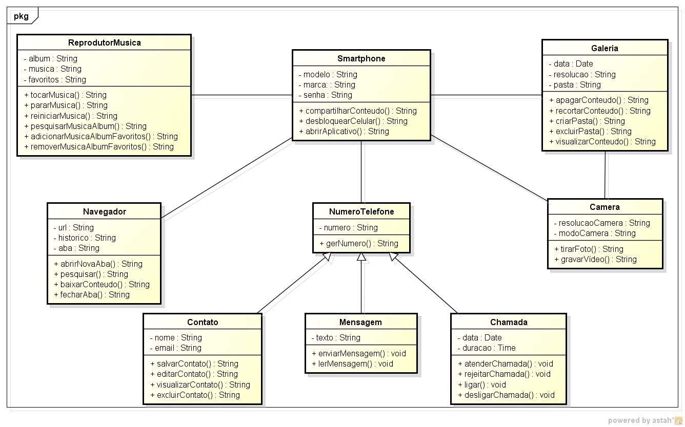

# Software de Smartphone Simplificado - Diagrama de Classes

Este projeto apresenta um modelo UML que representa um sistema de smartphone, incluindo suas funcionalidades e relacionamentos entre classes.

## Classes Principais

- Smartphone: Representa o dispositivo principal que gerencia todas as funcionalidades do smartphone.
- NumeroTelefone: Classe base para representar números de telefone, herdada por Contato, Chamada e Mensagem.
- Contato: Representa um contato na agenda do smartphone.
- Chamada: Representa uma chamada telefônica.
- Mensagem: Representa uma mensagem de texto.
- Aplicativo: Representa um aplicativo instalado no smartphone.
- Foto: Representa uma foto tirada pela câmera do smartphone.
- Camera: Responsável por capturar fotos.
- Galeria: Responsável por gerenciar e exibir fotos.
- Browser: Navegador de internet do smartphone.
- ReprodutorMusica: Reprodutor de música do smartphone.

## Funcionalidades

- O sistema permite operações típicas de um smartphone, como fazer chamadas, enviar mensagens, tirar fotos, navegar na internet e reproduzir música.
- Gerencia contatos na agenda e armazena informações relevantes sobre chamadas e mensagens.
- Aplicativos podem ser instalados e utilizados para diversas finalidades.

## Contribuindo

Sinta-se à vontade para contribuir com melhorias neste modelo de classes. Abra uma nova "issue" ou envie um "pull request" com suas sugestões.

## Autor

Este projeto foi desenvolvido por Jullia. Você pode entrar em contato comigo em https://www.linkedin.com/in/jullialayne/.

